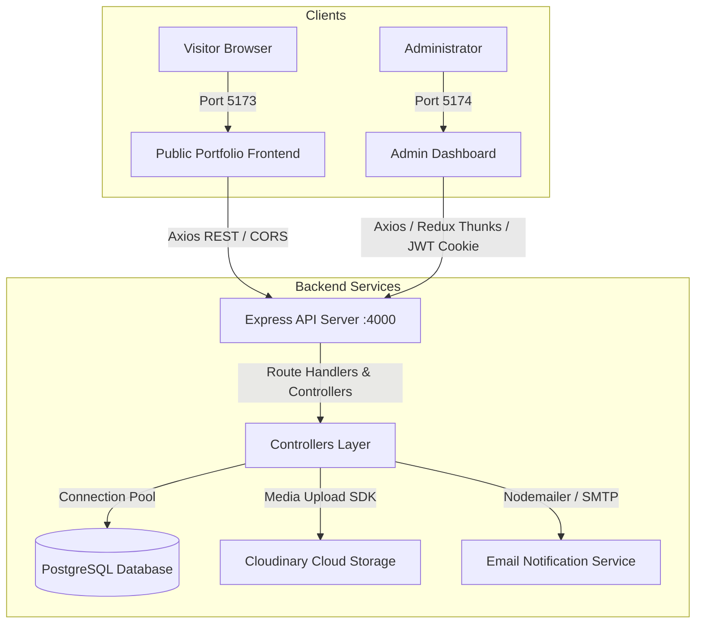

# Personal Portfolio & Headless Content Management System

A modern, production-ready full-stack developer portfolio and headless administrative management platform. Built with a decoupled three-tier architecture featuring a public portfolio frontend with dynamic animations, an administrator control dashboard with real-time state management, and an Express REST API backed by PostgreSQL and Cloudinary.

---

## Overview

This repository provides an end-to-end personal branding and content management solution:

- **Public Portfolio (`frontend/`)**: An interactive, responsive showcase for projects, technical skills, career timeline, education, and direct visitor inquiries. Powered by React 18, Vite, Framer Motion, and Tailwind CSS.
- **Administrator Dashboard (`dashboard/`)**: A secure administrative console providing complete CRUD operations over portfolio data (projects, skills, software tools, timeline events, profile details) and incoming messages. Powered by React 18, Vite, Redux Toolkit, and Radix UI.
- **Backend Service (`backend/`)**: A robust REST API providing JWT-based authentication via HTTP-only cookies, structured PostgreSQL persistence via `pg` connection pooling, automated table migrations, file upload handling via `express-fileupload`, and Cloudinary media integration.

---

## Architecture



### Layer Descriptions

1. **Presentation Layer (Frontend & Dashboard)**:
   - **Frontend (`http://localhost:5173`)**: Consumes public endpoints to dynamically render portfolio sections (Hero, About, Skills, Projects, Experience, Contact).
   - **Dashboard (`http://localhost:5174`)**: Consumes authenticated endpoints to provide administrative capabilities. Manages global auth state, async API requests, and toast feedback via Redux Toolkit.
2. **API & Business Logic Layer (`http://localhost:4000`)**:
   - Express 5 server orchestrating routing, JWT cookie parsing, request validation, error handling middleware, and file stream handling.
3. **Data & Storage Layer**:
   - **PostgreSQL**: Relational database storing users, projects, skills, timelines, software applications, and messages with relational constraints and timestamps.
   - **Cloudinary**: Cloud-based storage for high-resolution project banners, profile avatars, and resume documents.

---

## Repository Structure

```text
portfolio/
├── frontend/                     # Public portfolio client (Vite + React)
│   ├── public/                   # Static assets (favicons, badges)
│   ├── src/
│   │   ├── assets/               # Brand logos, avatars, illustration graphics
│   │   ├── components/           # UI components, custom cursor, particle background
│   │   ├── hooks/                # Custom React hooks (e.g., useMediaQuery)
│   │   ├── lib/                  # Shared utilities (Tailwind cn helper)
│   │   ├── pages/                # Page views (Home.jsx, ProjectView.jsx)
│   │   ├── sections/             # Modular sections (Hero, About, Skills, Projects, etc.)
│   │   ├── App.jsx               # Client router configuration
│   │   ├── config.js             # API base URL configuration
│   │   ├── index.css             # Tailwind base & theme token directives
│   │   └── main.jsx              # React application entry point
│   ├── .env.example              # Public frontend environment template
│   ├── package.json              # Frontend dependencies and scripts
│   ├── tailwind.config.js        # Design tokens, color palette, animations
│   └── vite.config.js            # Vite build configuration with alias resolver
│
├── dashboard/                    # Administrator dashboard client (Vite + React + Redux)
│   ├── public/                   # Auth illustration graphics and icons
│   ├── src/
│   │   ├── components/ui/        # Radix UI primitives (dialog, sheet, select, tabs, etc.)
│   │   ├── lib/                  # Utility helpers
│   │   ├── pages/                # Admin views (Login, HomePage, Manage*, ViewProject)
│   │   ├── store/                # Redux Toolkit store & feature slices
│   │   │   ├── slices/           # userSlice, projectSlice, skillSlice, etc.
│   │   │   └── store.js          # Centralized Redux store
│   │   ├── App.jsx               # Protected dashboard routes & lifecycle dispatchers
│   │   ├── config.js             # API base URL configuration
│   │   ├── index.css             # Dashboard Tailwind styling
│   │   └── main.jsx              # React entry point wrapped in Redux Provider
│   ├── .env.example              # Dashboard environment template
│   ├── package.json              # Dashboard dependencies and scripts
│   ├── tailwind.config.js        # Dashboard theme configuration
│   └── vite.config.js            # Dashboard Vite configuration
│
├── backend/                      # Express REST API & Database engine
│   ├── config/
│   │   ├── config.env            # Active backend environment variables (git-ignored)
│   │   └── config.env.example    # Backend environment variable template
│   ├── controller/               # API route handlers & controller logic
│   ├── database/                 # PostgreSQL pool connection & schema creation
│   ├── middlewares/              # Authentication verification & error handling
│   ├── models/                   # SQL table schema definitions
│   ├── router/                   # Router aliases & routing entry points
│   ├── routes/                   # Modular Express routers
│   ├── utils/                    # JWT token generators & utility helpers
│   ├── app.js                    # Express app configuration & middleware pipeline
│   ├── package.json              # Backend dependencies and scripts
│   ├── seedAdmin.js              # Initial administrator account seeder
│   ├── seedRealData.js           # Comprehensive portfolio database seeder
│   └── server.js                 # HTTP server listener entry point
│
├── .gitignore                    # Comprehensive repository exclusion rules
└── README.md                     # Single root project documentation
```

---

## Tech Stack

| Domain                 | Technology                                 | Details                                                  |
| :--------------------- | :----------------------------------------- | :------------------------------------------------------- |
| **Public Frontend**    | React 18, Vite 5                           | Fast SPA bundling, modular components                    |
| **Styling & Motion**   | Tailwind CSS, Framer Motion                | Custom dark theme, particle canvas, fluid transitions    |
| **Icons & Typography** | Lucide React, React Icons, Poppins, Roboto | Vector iconography, typography hierarchy                 |
| **Admin Dashboard**    | React 18, Redux Toolkit, Radix UI          | Centralized asynchronous state, accessible UI primitives |
| **Backend API**        | Node.js, Express 5                         | RESTful API, JSON body parser, file upload middleware    |
| **Database**           | PostgreSQL (`pg` pool)                     | Relational persistence, automated table migrations       |
| **Authentication**     | JSON Web Tokens (JWT), bcrypt              | Encrypted passwords, HTTP-only secure cookie sessions    |
| **Cloud Storage**      | Cloudinary SDK                             | Cloud storage for project screenshots and avatars        |

---

## Prerequisites

Ensure you have the following installed on your host system:

- **Node.js**: v18.0.0 or higher
- **npm**: v9.0.0 or higher
- **PostgreSQL**: v14.0 or higher running on port `5432` with a database created (default name: `portfolio_db`)

---

## Environment Variables Configuration

Create the corresponding `.env` or `config.env` files in each sub-application directory using the provided examples:

### 1. Backend (`backend/config/config.env`)

Template available at [backend/config/config.env.example](file:///d:/portfolio/backend/config/config.env.example):

```env
PORT=
PG_HOST=localhost
PG_PORT=5432
PG_DATABASE=
PG_USER=
PG_PASSWORD=your_postgres_password
PG_URI=postgresql://postgres:your_postgres_password
PORTFOLIO_URL=
DASHBOARD_URL=
CLOUDINARY_API_KEY=your_cloudinary_api_key
CLOUDINARY_CLOUD_NAME=your_cloudinary_cloud_name
CLOUDINARY_API_SECRET=your_cloudinary_api_secret
JWT_SECRET_KEY=your_secure_jwt_secret_key
JWT_EXPIRES=
COOKIE_EXPIRES=
COOKIE_EXPIRE=
```

### 2. Public Frontend (`frontend/.env`)

Template available at [frontend/.env.example](file:///d:/portfolio/frontend/.env.example):

```env
VITE_API_URL=http://localhost:4000
```

### 3. Admin Dashboard (`dashboard/.env`)

Template available at [dashboard/.env.example](file:///d:/portfolio/dashboard/.env.example):

```env
VITE_API_URL=http://localhost:4000
```

---

## Local Development Setup

Follow these steps to run all three applications concurrently in local development.

### Step 1: Install Dependencies

Run `npm install` inside each of the three directories:

```bash
# Backend dependencies
cd backend
npm install

# Public frontend dependencies
cd ../frontend
npm install

# Admin dashboard dependencies
cd ../dashboard
npm install
```

### Step 2: Database Initialization (Optional Seed)

Ensure your PostgreSQL service is running and `portfolio_db` is created.
When the backend starts, table schemas are created automatically if they do not already exist.

To seed initial portfolio data:

```bash
cd backend
node seedRealData.js
```

### Step 3: Start Services

Open three dedicated terminal windows:

#### Terminal 1 — Backend API (`http://localhost:4000`)

```bash
cd backend
npm start
# For live reloading during development:
# npm run dev
```

#### Terminal 2 — Public Portfolio Frontend (`http://localhost:5173`)

```bash
cd frontend
npm run dev
```

#### Terminal 3 — Administrator Dashboard (`http://localhost:5174`)

```bash
cd dashboard
npm run dev
```

---

## Administrator Access & Authentication

- **Dashboard Login URL:** `http://localhost:5174/login`
- **Security Notice:** Administrator access requires valid credentials configured in the application's authentication/database system. Never commit administrator credentials or secrets to source control.
- Authentication utilizes JSON Web Tokens transmitted through HTTP-only cookies (`token`). Protected endpoints verify this token via `backend/middlewares/auth.js`.

---

## API Documentation & Endpoint Reference

Base URL: `http://localhost:4000/api/v1`

### User & Authentication (`/user`)

| Method | Endpoint                             | Auth Required | Description                                             |
| :----- | :----------------------------------- | :-----------: | :------------------------------------------------------ |
| `POST` | `/api/v1/user/login`                 |      No       | Authenticate admin, set HTTP-only JWT cookie            |
| `GET`  | `/api/v1/user/logout`                |      Yes      | Clear JWT session cookie and terminate session          |
| `GET`  | `/api/v1/user/me`                    |      Yes      | Get authenticated administrator details                 |
| `GET`  | `/api/v1/user/portfolio/me`          |      No       | Get public portfolio owner profile (avatar, bio, links) |
| `PUT`  | `/api/v1/user/update/me`             |      Yes      | Update profile details, avatar image, or resume         |
| `PUT`  | `/api/v1/user/password/update`       |      Yes      | Change administrator account password                   |
| `POST` | `/api/v1/user/password/forgot`       |      No       | Request password reset token                            |
| `PUT`  | `/api/v1/user/password/reset/:token` |      No       | Reset password using verified token                     |

### Projects (`/project`)

| Method   | Endpoint                     | Auth Required | Description                                       |
| :------- | :--------------------------- | :-----------: | :------------------------------------------------ |
| `POST`   | `/api/v1/project/add`        |      Yes      | Create a new project entry with Cloudinary banner |
| `GET`    | `/api/v1/project/getall`     |      No       | Fetch all projects for public portfolio display   |
| `GET`    | `/api/v1/project/get/:id`    |      No       | Fetch single project details by ID                |
| `PUT`    | `/api/v1/project/update/:id` |      Yes      | Update project fields or banner image             |
| `DELETE` | `/api/v1/project/delete/:id` |      Yes      | Delete a project and remove its Cloudinary banner |

### Skills (`/skill`)

| Method   | Endpoint                   | Auth Required | Description                                 |
| :------- | :------------------------- | :-----------: | :------------------------------------------ |
| `POST`   | `/api/v1/skill/add`        |      Yes      | Add new technical skill with icon SVG/image |
| `GET`    | `/api/v1/skill/getall`     |      No       | Retrieve all skills grouped by category     |
| `PUT`    | `/api/v1/skill/update/:id` |      Yes      | Update skill proficiency percentage         |
| `DELETE` | `/api/v1/skill/delete/:id` |      Yes      | Remove a skill entry                        |

### Timeline & Experience (`/timeline`)

| Method   | Endpoint                      | Auth Required | Description                                      |
| :------- | :---------------------------- | :-----------: | :----------------------------------------------- |
| `POST`   | `/api/v1/timeline/add`        |      Yes      | Add career timeline event (education/experience) |
| `GET`    | `/api/v1/timeline/getall`     |      No       | Retrieve timeline events in chronological order  |
| `DELETE` | `/api/v1/timeline/delete/:id` |      Yes      | Delete timeline event                            |

### Software Applications / Tools (`/softwareapplication`)

| Method   | Endpoint                                 | Auth Required | Description                        |
| :------- | :--------------------------------------- | :-----------: | :--------------------------------- |
| `POST`   | `/api/v1/softwareapplication/add`        |      Yes      | Add development software/tool      |
| `GET`    | `/api/v1/softwareapplication/getall`     |      No       | Retrieve all software applications |
| `DELETE` | `/api/v1/softwareapplication/delete/:id` |      Yes      | Delete software application entry  |

### Messages & Inquiries (`/message`)

| Method   | Endpoint                     | Auth Required | Description                                       |
| :------- | :--------------------------- | :-----------: | :------------------------------------------------ |
| `POST`   | `/api/v1/message/send`       |      No       | Submit contact form inquiry from public portfolio |
| `GET`    | `/api/v1/message/getall`     |      Yes      | Fetch all received contact inquiries              |
| `DELETE` | `/api/v1/message/delete/:id` |      Yes      | Delete message inquiry                            |

---

## Production Builds

Both frontend applications compile to standalone, optimized static assets ready for deployment on static hosting providers (Vercel, Netlify, Cloudflare Pages, Nginx, AWS S3):

### Build Public Portfolio:

```bash
cd frontend
npm run build
```

Output directory: `frontend/dist/`

### Build Admin Dashboard:

```bash
cd dashboard
npm run build
```

Output directory: `dashboard/dist/`

---

## Troubleshooting

1. **Port Conflicts**:
   - Backend requires port `4000`. If busy, terminate conflicting node processes with:
     ```powershell
     Get-Process -Name node | Stop-Process -Force
     ```
   - Vite automatically falls back to `5174` if `5173` is occupied.
2. **Database Connection Errors**:
   - Ensure the PostgreSQL Windows Service is active:
     ```powershell
     Get-Service -Name postgresql*
     ```
   - Verify connection credentials in `backend/config/config.env`.
3. **CORS Restrictions**:
   - Ensure `PORTFOLIO_URL` and `DASHBOARD_URL` match your active client URLs in `config.env`.

---

## Security Practices

- **Never Commit Secrets**: Real database credentials, Cloudinary API secrets, and JWT secret keys must remain exclusively inside `config.env` and local `.env` files.
- **Git Tracking Exclusions**: Verify that `config.env`, `.env`, and all credentials files are excluded by `.gitignore`.
- **JWT Protection**: Tokens are signed with HMAC SHA256 and transmitted with `HttpOnly` and `SameSite` flags.

---

## Author

- **Name**: Rajiv Jha
- **Position**: Computer Science Student · Aspiring AIML Engineer
- **GitHub**: [https://github.com/jharajiv315](https://github.com/jharajiv315)
- **LinkedIn**: [https://www.linkedin.com/in/rajiv-jha-9b36ba3a2/](https://www.linkedin.com/in/rajiv-jha-9b36ba3a2/)
