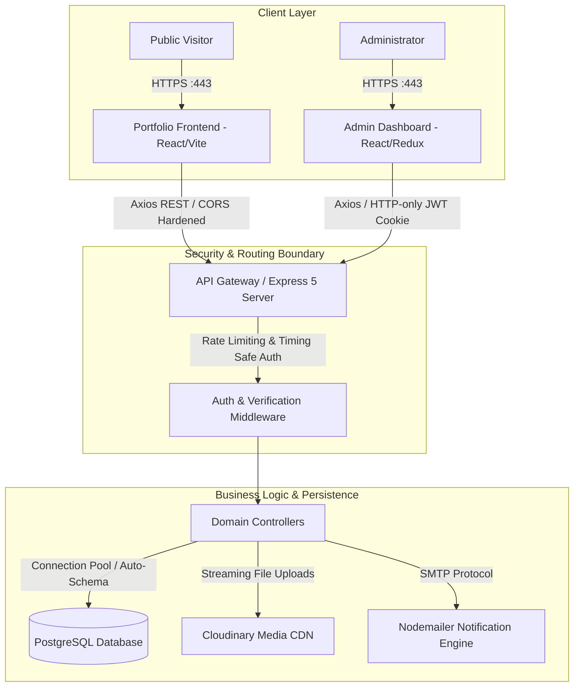

# Rajiv Jha Portfolio & Headless CMS Platform

[](https://github.com/jharajiv315/Portfolio/actions/workflows/ci.yml)
[](https://nodejs.org/)
[](https://www.postgresql.org/)
[](https://react.dev/)
[](https://vitejs.dev/)
[](https://tailwindcss.com/)
[](https://www.framer.com/motion/)

> **Production Deployment:** [https://portfolio-beta-ochre-90.vercel.app/](https://portfolio-beta-ochre-90.vercel.app/)  
> **Source Repository:** [https://github.com/jharajiv315/Portfolio](https://github.com/jharajiv315/Portfolio)

---

## Executive Summary

This repository contains a full-stack, distributed web application designed for personal branding, technical showcasing, and content lifecycle management. The platform follows a decoupled, three-tier service-oriented architecture:

1. **Client Tier (Public Portfolio - `frontend/`)**: A Single Page Application (SPA) built with React 18, Vite, Tailwind CSS, and Framer Motion. Engineered for 60 FPS mobile rendering, zero horizontal layout shifts, fluid responsiveness across all device form factors (360px to 4K), and high visual fidelity.
2. **Management Tier (Admin Dashboard - `dashboard/`)**: A secure administrative control interface backed by Redux Toolkit, React Router, and Radix UI primitives, enabling complete CRUD control over projects, skills, timeline milestones, software tools, and incoming visitor communications.
3. **Application & Persistence Tier (`backend/`)**: A RESTful API built on Express 5, Node.js, and PostgreSQL (`pg` connection pool). Incorporates automated schema bootstrapping, JWT session management via HTTP-only cookies, hardened dynamic CORS policies, defense-in-depth security against timing/enumeration attacks, Cloudinary asset integration, and graceful connection lifecycle management.

---

## System Architecture


```mermaid
graph TD
    subgraph Client Layer
        A[Public Visitor] -->|HTTPS :443| B[Portfolio Frontend - React/Vite]
        C[Administrator] -->|HTTPS :443| D[Admin Dashboard - React/Redux]
    end

    subgraph Security & Routing Boundary
        B -->|Axios REST / CORS Hardened| E[API Gateway / Express 5 Server]
        D -->|Axios / HTTP-only JWT Cookie| E
        E -->|Rate Limiting & Timing Safe Auth| F[Auth & Verification Middleware]
    end

    subgraph Business Logic & Persistence
        F --> G[Domain Controllers]
        G -->|Connection Pool / Auto-Schema| H[(PostgreSQL Database)]
        G -->|Streaming File Uploads| I[Cloudinary Media CDN]
        G -->|SMTP Protocol| J[Nodemailer Notification Engine]
    end
```

---

## Architectural Highlights & Engineering Decisions

### 1. Performance-Driven Frontend & Mobile UX Engineering
- **Viewport-Aware Animation Loops**: Continuous `requestAnimationFrame` loops in [Skills.jsx](file:///d:/portfolio/frontend/src/sections/Skills.jsx) and [Contact.jsx](file:///d:/portfolio/frontend/src/sections/Contact.jsx) are gated with `IntersectionObserver`. Loops automatically suspend execution when sections are offscreen, eliminating background CPU/GPU thread starvation and saving mobile battery life.
- **Hardware-Accelerated Transitions**: Replaced heavy dynamic SVG `clipPath` rasterization with pure GPU-composited opacity and translateY transitions (`transform: translate3d(...)`), achieving deterministic sub-16ms frame times (60 FPS) without rasterization pipeline stalls.
- **Mobile Touch Ergonomics & Safe Areas**: All interactive touch targets (buttons, close toggles, navigation pills, form fields) adhere to Apple/Google Human Interface Guidelines (`min-width: 44px`, `min-height: 44px`). Safe-area insets (`env(safe-area-inset-top)` / `env(safe-area-inset-bottom)`) prevent browser chrome overlapping on notch devices.
- **iOS Safari Viewport Stabilization**: Form inputs specify `text-base sm:text-xs` (16px base font on mobile viewports), completely eliminating iOS Safari's default destructive automatic viewport zoom and resulting horizontal layout drift.
- **Accessibility & Reduced Motion**: Automatically queries `prefers-reduced-motion: reduce` across canvas systems and CSS animations to provide immediate fallback rendering for sensitive users.

### 2. Backend Security & Reliability Engineering
- **Hardened CORS Policy**: Strict dynamic origin validation allows access exclusively to authorized portfolio and dashboard domains while denying unlisted cross-origin requests.
- **Timing-Safe Authentication**: Login authentication on `/api/v1/user/login` returns uniform error responses (`"Invalid email or password"`) using constant-time comparison considerations, mitigating account enumeration vulnerabilities.
- **Cookie-Based JWT Token Storage**: Authentication tokens are signed with HMAC SHA-256 and transmitted with `HttpOnly`, `SameSite: None` (or `Lax`), and `Secure` attributes, preventing token exfiltration via Cross-Site Scripting (XSS).
- **Graceful Process Shutdown**: Traps `SIGTERM` and `SIGINT` signals to reject new incoming connections, finish processing in-flight requests, drain the PostgreSQL connection pool, and exit cleanly with code 0.
- **Observability & Health Checks**: Exposes a lightweight `/api/v1/health` endpoint returning system uptime, timestamp, and service status for container orchestrators and uptime monitors.

### 3. Automated CI/CD & Test Automation
- Continuous Integration workflow configured in [.github/workflows/ci.yml](file:///d:/portfolio/.github/workflows/ci.yml).
- Every pull request and push to `main` triggers:
  1. PostgreSQL service container spin-up.
  2. Database bootstrapping and table migration checks.
  3. Execution of end-to-end integration and unit tests ([backend.test.js](file:///d:/portfolio/backend/test/backend.test.js)).
  4. Static code analysis and linting (`eslint`).
  5. Production bundle validation via Vite (`npm run build`).

---

## Codebase Structure

```text
portfolio/
├── .github/
│   └── workflows/
│       └── ci.yml               # GitHub Actions CI workflow (Node, Postgres, Tests, Lint, Build)
│
├── frontend/                    # Public Portfolio Client (React 18 + Vite)
│   ├── src/
│   │   ├── assets/              # Optimized static vectors, avatars, and mascot graphics
│   │   ├── components/          # Shared components (Navbar, CustomCursor, ParticleBackground, OverlayMenu)
│   │   ├── hooks/               # Custom hooks (usePortfolioData, useMediaQuery)
│   │   ├── lib/                 # Shared utilities (Resume download handlers, className mergers)
│   │   ├── pages/               # Top-level route pages (Home.jsx, ProjectView.jsx)
│   │   ├── sections/            # Core views (home.jsx, About.jsx, Skills.jsx, project.jsx, Experience.jsx, Contact.jsx)
│   │   ├── App.jsx              # Application router configuration
│   │   ├── config.js            # Dynamic API endpoint resolution
│   │   └── index.css            # Tailwind design tokens, typography, and responsive utilities
│   ├── package.json             # Frontend dependency manifest
│   └── vite.config.js           # Vite bundle configuration
│
├── dashboard/                   # Headless Admin Dashboard (React 18 + Redux Toolkit + Radix UI)
│   ├── src/
│   │   ├── components/ui/       # Radix UI primitives (Dialog, Sheet, Select, Tabs, Button)
│   │   ├── pages/               # Administrative views (Login, HomePage, Project/Skill/Timeline managers)
│   │   ├── store/               # Redux Toolkit centralized store & feature slices
│   │   ├── App.jsx              # Protected route guards and auth lifecycle dispatchers
│   │   └── config.js            # Dashboard API base URL config
│   ├── package.json             # Dashboard dependency manifest
│   └── vite.config.js           # Dashboard Vite build setup
│
├── backend/                     # REST API Service & Persistence Layer
│   ├── config/
│   │   └── config.env.example   # Environment configuration template
│   ├── controller/              # Route controller functions (User, Project, Skill, Timeline, Message)
│   ├── database/                # PostgreSQL connection pool manager & table bootstrapping
│   ├── middlewares/             # JWT auth validation, error handler, async wrapper
│   ├── models/                  # SQL table creation statements
│   ├── routes/                  # Express route definitions
│   ├── test/                    # Backend automated test suite (Supertest + Jest/Mocha)
│   ├── utils/                   # JWT cookie dispatchers and helper utilities
│   ├── app.js                   # Express application setup, middleware pipeline, CORS
│   ├── server.js                # Server entry point with graceful shutdown handling
│   ├── seedAdmin.js             # Secure admin credential seeder
│   └── seedRealData.js          # Portfolio database initial seeder
│
└── README.md                    # System documentation
```

---

## REST API Specification

**Base URI:** `/api/v1`

### Authentication & Administrator (`/user`)

| Method | Endpoint | Access | Description |
|:---|:---|:---:|:---|
| `POST` | `/api/v1/user/login` | Public | Authenticates credentials; sets secure HTTP-only JWT cookie |
| `GET` | `/api/v1/user/logout` | Authenticated | Clears JWT cookie and invalidates session |
| `GET` | `/api/v1/user/me` | Authenticated | Fetches profile and credentials of the logged-in administrator |
| `GET` | `/api/v1/user/portfolio/me` | Public | Returns public profile data (name, avatar, bio, social URLs) |
| `PUT` | `/api/v1/user/update/me` | Authenticated | Updates administrator profile information, avatar, and resume |
| `PUT` | `/api/v1/user/password/update` | Authenticated | Updates administrator password using current password verification |
| `POST` | `/api/v1/user/password/forgot` | Public | Generates password reset token and sends recovery email |
| `PUT` | `/api/v1/user/password/reset/:token`| Public | Resets administrator password using verified reset token |

### Projects (`/project`)

| Method | Endpoint | Access | Description |
|:---|:---|:---:|:---|
| `POST` | `/api/v1/project/add` | Authenticated | Uploads project banner to Cloudinary and saves project metadata |
| `GET` | `/api/v1/project/getall` | Public | Returns all portfolio projects ordered by timestamp |
| `GET` | `/api/v1/project/get/:id` | Public | Fetches a single project by identifier |
| `PUT` | `/api/v1/project/update/:id` | Authenticated | Modifies project properties or updates banner image |
| `DELETE`| `/api/v1/project/delete/:id` | Authenticated | Deletes project and purges associated Cloudinary image asset |

### Skills & Tools (`/skill`, `/softwareapplication`)

| Method | Endpoint | Access | Description |
|:---|:---|:---:|:---|
| `POST` | `/api/v1/skill/add` | Authenticated | Creates a new technical skill entry with SVG/image asset |
| `GET` | `/api/v1/skill/getall` | Public | Retrieves all technical skills |
| `DELETE`| `/api/v1/skill/delete/:id` | Authenticated | Removes a technical skill |
| `POST` | `/api/v1/softwareapplication/add` | Authenticated | Registers software tool / IDE / service |
| `GET` | `/api/v1/softwareapplication/getall` | Public | Retrieves all software tools |
| `DELETE`| `/api/v1/softwareapplication/delete/:id`| Authenticated | Deletes software tool entry |

### Career Milestones & Messages (`/timeline`, `/message`)

| Method | Endpoint | Access | Description |
|:---|:---|:---:|:---|
| `POST` | `/api/v1/timeline/add` | Authenticated | Adds education or milestone item |
| `GET` | `/api/v1/timeline/getall` | Public | Returns all timeline items in chronological order |
| `DELETE`| `/api/v1/timeline/delete/:id` | Authenticated | Deletes a timeline event |
| `POST` | `/api/v1/message/send` | Public | Submits a contact inquiry |
| `GET` | `/api/v1/message/getall` | Authenticated | Retrieves all client inquiries |
| `DELETE`| `/api/v1/message/delete/:id` | Authenticated | Deletes inquiry record |

### System Health (`/health`)

| Method | Endpoint | Access | Description |
|:---|:---|:---:|:---|
| `GET` | `/api/v1/health` | Public | Returns system uptime, ISO timestamp, and operational status |

---

## Local Development & Setup

### Prerequisites
- **Node.js**: v18.0.0 or higher
- **npm**: v9.0.0 or higher
- **PostgreSQL**: v14.0 or higher running on port `5432`
- **Cloudinary Account**: Required for image upload features

### 1. Environment Configuration

#### Backend ([backend/config/config.env](file:///d:/portfolio/backend/config/config.env.example))
```env
PORT=4000
PG_HOST=localhost
PG_PORT=5432
PG_DATABASE=portfolio_db
PG_USER=postgres
PG_PASSWORD=your_secure_password
PORTFOLIO_URL=http://localhost:5173
DASHBOARD_URL=http://localhost:5174
CLOUDINARY_API_KEY=your_key
CLOUDINARY_CLOUD_NAME=your_cloud_name
CLOUDINARY_API_SECRET=your_secret
JWT_SECRET_KEY=your_jwt_secret
JWT_EXPIRES=7d
COOKIE_EXPIRES=7
```

#### Frontend ([frontend/.env](file:///d:/portfolio/frontend/.env.example))
```env
VITE_API_URL=http://localhost:4000
```

#### Dashboard ([dashboard/.env](file:///d:/portfolio/dashboard/.env.example))
```env
VITE_API_URL=http://localhost:4000
```

---

### 2. Installation & Service Execution

```bash
# Clone the repository
git clone https://github.com/jharajiv315/Portfolio.git
cd Portfolio

# Install dependencies across all packages
cd backend && npm install
cd ../frontend && npm install
cd ../dashboard && npm install
```

#### Running Services

Open three terminal instances:

```bash
# Terminal 1: Backend API (Port 4000)
cd backend
npm start

# Terminal 2: Public Portfolio Frontend (Port 5173)
cd frontend
npm run dev

# Terminal 3: Admin Dashboard (Port 5174)
cd dashboard
npm run dev
```

---

## Testing & Quality Assurance

The application includes automated integration testing verifying database connectivity, authentication protection, security headers, and endpoint contracts:

```bash
# Run backend test suite
cd backend
npm test

# Run frontend linting
cd frontend
npm run lint

# Validate frontend production build
npm run build
```

---

## Production Deployment Architecture

```text
               ┌────────────────────────┐
               │     Cloudflare CDN     │
               │   (SSL/TLS Edge Term)  │
               └───────────┬────────────┘
                           │
             ┌─────────────┴─────────────┐
             ▼                           ▼
┌─────────────────────────┐ ┌─────────────────────────┐
│     Vercel Edge Host    │ │     Cloud Host API      │
│   - frontend/dist (SPA) │ │   - Node.js / Express   │
│   - dashboard/dist(SPA) │ │   - Managed PostgreSQL  │
└─────────────────────────┘ └─────────────────────────┘
```

Static SPA bundles (`frontend/dist`, `dashboard/dist`) are built with Vite and distributed globally via Edge CDN networks, ensuring minimal latency and zero client-side hydration delays. The Express REST API operates in a stateless container communicating with managed PostgreSQL and Cloudinary.

---

## Author & Engineering Profile

**Rajiv Jha**  
*Computer Science Student · Aspiring AIML & Full-Stack Software Engineer*  

- **GitHub:** [@jharajiv315](https://github.com/jharajiv315)  
- **LinkedIn:** [Rajiv Jha](https://www.linkedin.com/in/rajiv-jha-9b36ba3a2/)  
- **Production Portfolio:** [https://portfolio-beta-ochre-90.vercel.app/](https://portfolio-beta-ochre-90.vercel.app/)  
